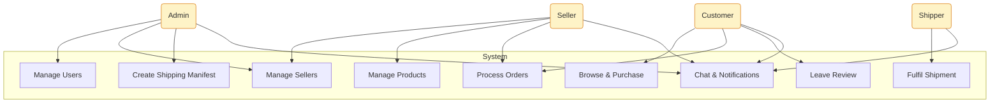
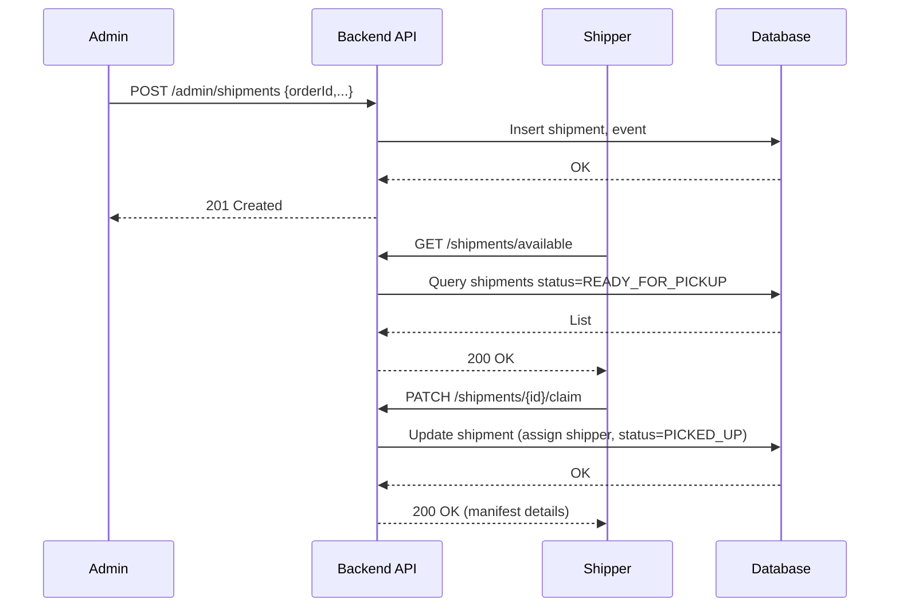
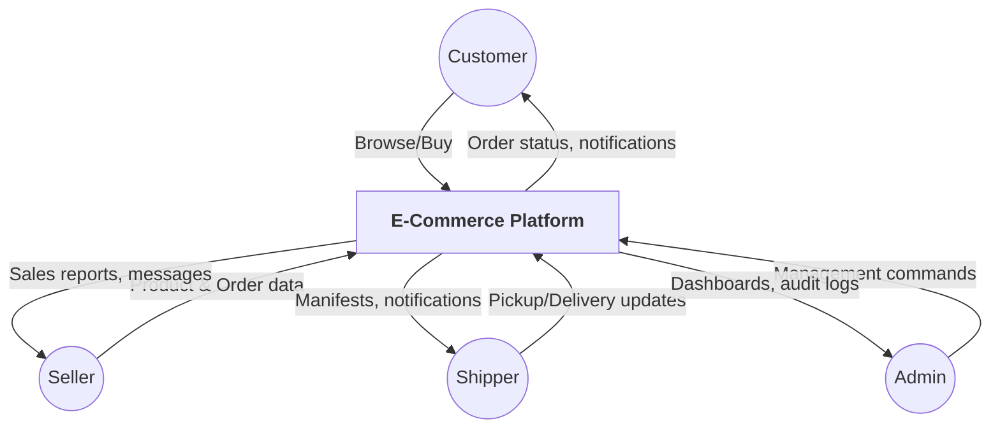
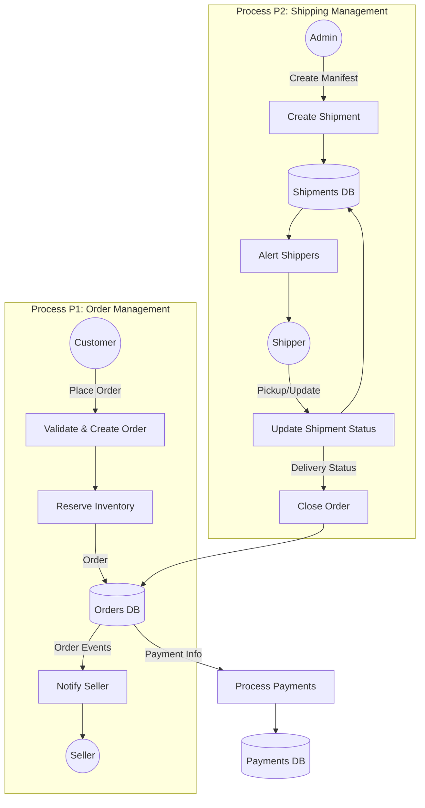
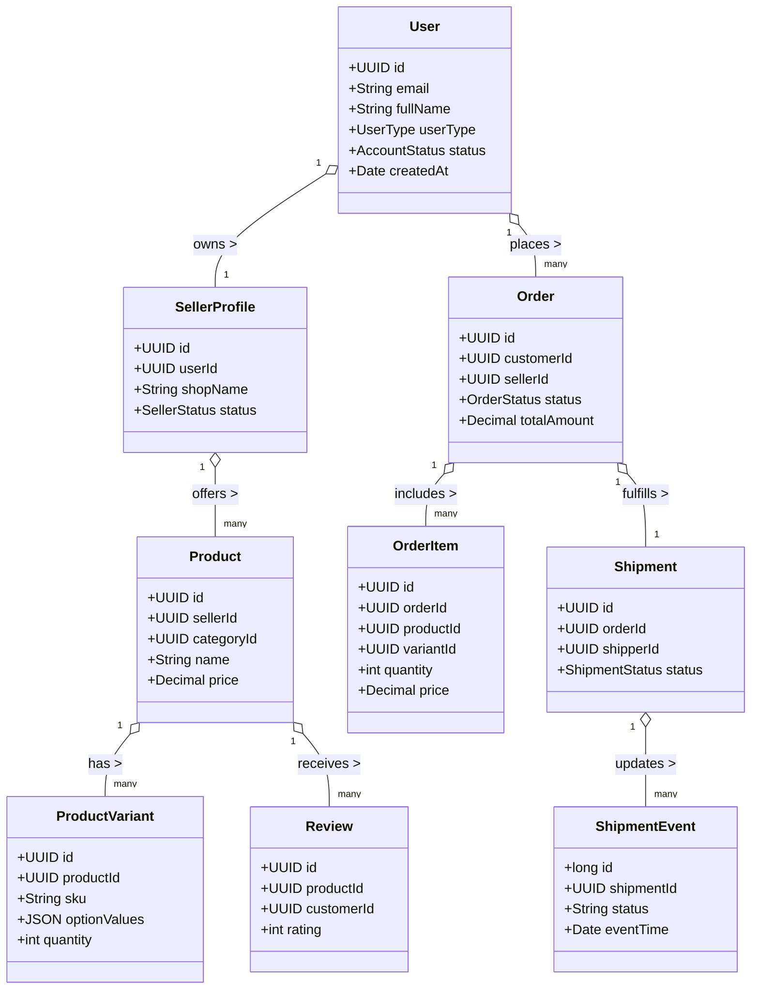
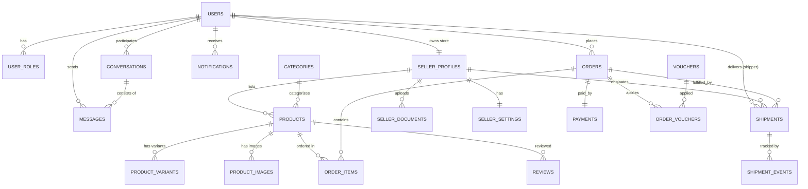

# System Diagrams (Conceptual)

> The diagrams below are generated with Mermaid syntax so they can be previewed
> in compatible editors. They reflect the planned admin, seller, shipper, and
> customer interactions with the platform.

## 1. Use Case Diagram



## 2. Activity Diagram – Admin Creates Shipping Manifest

```mermaid
flowchart TD
  Start([Start]) --> A[Admin selects pending order]
  A --> B{Order already has shipment?}
  B -- Yes --> End1([Abort: already created])
  B -- No --> C[Fill shipment form<br/>(pickup, delivery, weight, COD)]
  C --> D[Assign shipper (optional)]
  D --> E[Submit manifest]
  E --> F[Persist shipment + event READY_FOR_PICKUP]
  F --> G[Notify shipper(s)]
  G --> End([Done])
```

## 3. Sequence Diagram – Shipper Claims Shipment



## 4. DFD Level 0 (Context)



## 5. DFD Level 1 – Order & Shipment Processes



## 6. Class Diagram (High-Level)



## 7. Entity Relationship Diagram (ERD)



These diagrams are conceptual and align with the schema in `docs/database-schema.sql`. 
They can be refined further once the detailed business rules and backend implementations
are finalized.

